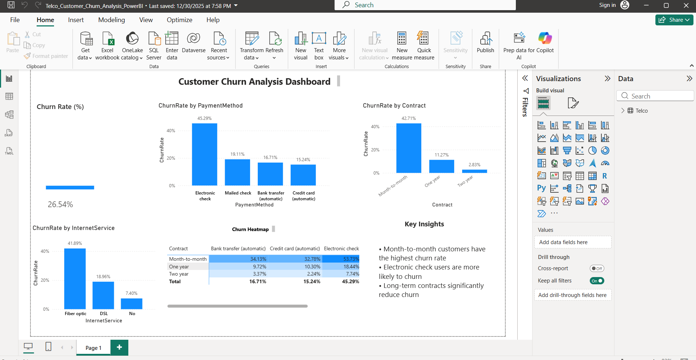
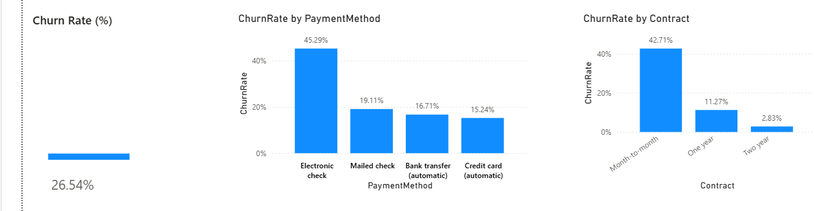
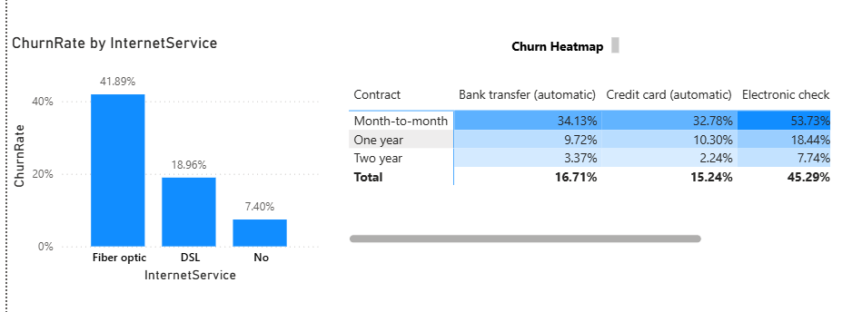
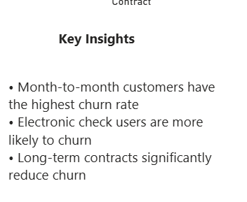

# Customer Churn Analysis Dashboard

Interactive Power BI dashboard designed to analyze customer churn patterns, identify retention opportunities, and provide actionable business insights using telecom customer data.

---

## Overview

Customer churn is one of the most critical business metrics for subscription-based companies. This project analyzes customer behavior, contract information, payment methods, tenure, and service usage to identify factors contributing to customer churn.

The dashboard provides business intelligence insights that help organizations improve customer retention strategies and reduce customer attrition.

---

## Project Objectives

- Analyze customer churn trends
- Identify high-risk customer segments
- Understand customer retention patterns
- Evaluate contract and payment method impact
- Track business KPIs
- Generate actionable business insights

---

## Dataset Information

Dataset: Telco Customer Churn Dataset

Total Records:
- 7,043 Customers

Features:
- Customer Demographics
- Contract Type
- Monthly Charges
- Total Charges
- Internet Services
- Payment Methods
- Tenure Information
- Churn Status

---

## Dashboard Features

### KPI Dashboard
- Total Customers
- Active Customers
- Churned Customers
- Churn Rate
- Revenue Insights

### Customer Segmentation
- Gender Analysis
- Senior Citizen Analysis
- Partner & Dependents Analysis

### Contract Analysis
- Month-to-Month Contracts
- One-Year Contracts
- Two-Year Contracts

### Payment Method Analysis
- Electronic Check
- Credit Card
- Bank Transfer
- Mailed Check

### Service Analysis
- Internet Services
- Phone Services
- Streaming Services
- Security Services

### Churn Insights
- Customer Retention Trends
- Churn Drivers
- High-Risk Customer Groups

---

## Technologies Used

- Power BI
- Python
- Pandas
- Excel
- Data Analytics
- Business Intelligence
- Data Visualization

---

## Project Structure

```text
customer-churn-analysis-dashboard
│
├── dashboard
│   └── Telco_Customer_Churn_Analysis.pbix
│
├── dataset
│   └── Telco_Customer_Churn_Dataset.csv
│
├── screenshots
│   ├── dashboard-overview.png
│   ├── churn-analysis.png
│   ├── customer-segmentation.png
│   └── kpi-dashboard.png
│
├── README.md
└── LICENSE
```

---

## Project Screenshots

### Dashboard Overview



### Churn Analysis



### Customer Segmentation



### KPI Dashboard



---

## Key Business Insights

- Month-to-month contract customers show significantly higher churn rates.
- Long-term contract customers demonstrate stronger retention.
- Electronic check users are more likely to churn.
- Higher tenure customers tend to remain loyal.
- Service usage patterns directly influence customer retention.

---

## Future Enhancements

- Machine Learning Churn Prediction
- Customer Lifetime Value Analysis
- Retention Recommendation System
- Real-Time Analytics Dashboard
- Advanced Predictive Modeling

---

## Author

**Syed Shahed**

AI Engineer | Data Analyst | Machine Learning Enthusiast

GitHub:
https://github.com/Syed-SS

LinkedIn:
https://linkedin.com/in/syedshahed-ai

---

## License

This project is licensed under the MIT License.
